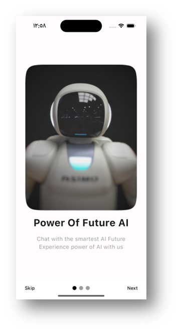
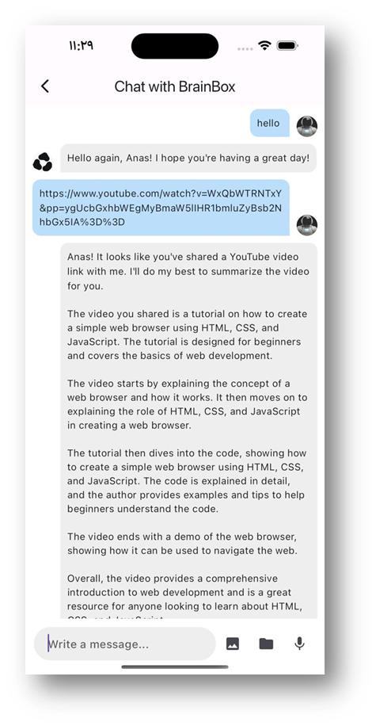
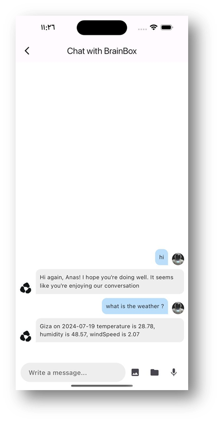
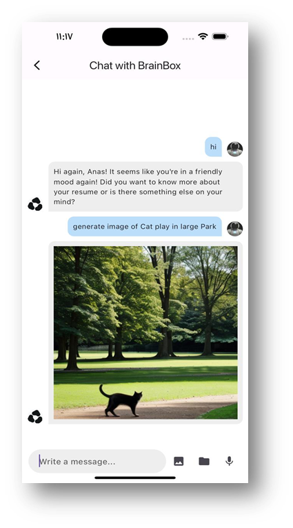

# AI-Powered Personal Assistant for Mobile Applications

## Overview

This project is an **AI-powered personal assistant** integrated into a mobile application to help users perform daily tasks efficiently.

The system combines **Natural Language Processing (NLP), automation, and mobile development** to deliver a seamless user experience using **Llama 3 via Groq**.

---

## Problem Statement

Managing daily tasks manually can be time-consuming.

This project aims to:

* Automate everyday activities
* Provide intelligent responses instantly
* Enhance productivity using AI
* Deliver a personalized user experience by leveraging stored user data, enabling the assistant to remember user preferences and context over time

---

## Features

* Voice & Text Commands
* Email & Messaging
* YouTube Video Summarization
* Google, Jumia Shopping
* Wikipedia Search
* Image-to-Text Recognition
* AI Image Generation
* Event & Reminder Management
* Weather & News Updates

---

## System Architecture

* **Backend:** FastAPI
* **Frontend:** Flutter
* **Database:** Firebase
* **LLM:** Llama 3 via Groq
* **API Exposure:** Ngrok

---

## How it Works

1️- User sends a command (voice, text, image, or document)

2️- The request is sent to the FastAPI backend

3️- The system processes the input:

    - Text/Voice: handled by the LLM (Llama 3 via Groq)
    
    - Images: processed using image recognition (OCR)
    
    - Documents: analyzed and summarized

4️- The assistant generates a response or performs the requested action

5️- The result is returned to the mobile application


---

## Screenshots

### Home Screen



This is the entry screen of the mobile application, introducing users to the AI assistant experience.

---

### Video Summarization



The assistant summarizes YouTube videos by extracting key insights, saving users time and effort.

---

### Weather 



The assistant provides **weather updates** based on the user's context or request.
It can adapt responses dynamically, delivering relevant information such as current conditions and recommendations tailored to the user.
Note that it can remember the user name.  

---

### Image Generation



Users can generate images using text prompts. The assistant converts ideas into visuals using AI-powered image generation.

---


## How to Run

### 1- Clone the repository

```bash id="d5w8mn"
git clone https://github.com/engasmaaibrahim/AI-Powered-Personal-Assistant.git
cd AI-Powered-Personal-Assistant
```

---

### 2️- Backend Setup

```bash id="2hljpf"
pip install -r requirements.txt
uvicorn main:app --reload
```


---


## Author

**Asmaa Ibrahim**
AI & Machine Learning Engineer
